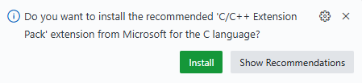

---
author:
- Camilo de Lellis
bibliography:
- references.bib
title: Beginner at C/C++
---

# Introduction to C/C++

## What is C++

C++ is a *object-oriented programming language* being used in the most
diverse applications. For this reason it is called a *general purpose
language* . It is a *superset* of the C programming language, being a
extension including object oriented features that C lacks.

C++ was originally called "C with classes" and was concepted when Bjarne
Stroustrup, a computer scientist, thought that it would be cool to add
object-oriented concepts to C. He then added classes, virtual functinos,
operator overloading, multiple inheritance, templates and exception
handling. This was how C++ was born.

Some other features introduced by C++ were:

## Why use C/C++

After some thought, I figured that I wanted to work with ML hardware,
algorithm optimization, GPU development and signal processing. Such
areas need a strong understanding of math, programming and computer
architecture. In that sense, it was indispensable to learn a general
purpose language that would allow me to have access to the hardware and
software as much as possible. C and C++ came to mind and were pretty
much confirmed as my ideal targets when I came to know that they were
used a lot in this area that I became fond of.

With this repo, I intend to get strong foundations in the fundamentals
of C and C++, even though I am a bit familiar with it’s syntax, since
most of my projects were focused on web development, I am quite
unfamiliar with how these languages can be used in the context I intend
to apply it.I intend to write these notes with C++ in mind because it
seems the more suitable from a market perspective, but I want to compare
the code to C as much as possible and say where it would be better to
implement something in C and when it would be better to do so in C++.

That should make we ask ourselves, why do people still use C if C++ is
supposed to do all C does and much more? The answer is fairly simple.
Let’s take the operating systems called Linux as an example. Its kernel
is written in C, even though C++ has many more features. In the case of
a operating system kernel, performance is everything, and those feature
could be quite detrimental. Object oriented code with classes and
virtual lookup tables for method overloading add some steps that do not
really offer any value. C is much closer to ASM than C++, making it
perfect for the job. It is also safe to say that C is incredibly much
simpler, that makes it really simple to learn and debugg, different from
C++. In that sense, when features missing from C are needed for a
project, the wise choice is to pick C++.

## Setting up a text editor

To write code in C and C++ we need to adopt a text editor. A text editor
is nothing more than a computer program used to write inside files.

The first editor we’ll show how to set up is Visual Studio Code from
Microsoft. This is the [download
link](https://code.visualstudio.com/download) for VSCode. For this repo,
I’ll adopt Linux, Ubuntu 24.04.3 LTS as the default operating system. To
download the [latest
version](https://go.microsoft.com/fwlink/?LinkID=760868) at time of
writing, you can use the following command:

``` bash
wget https://vscode.download.prss.microsoft.com/dbazure/download/stable/7d842fb85a0275a4a8e4d7e040d2625abbf7f084/code_1.105.1-1760482543_amd64.deb
```

After that, you just need to install it using the command:

``` bash
sudo dpkg -i code_1.105.1-1760482543_amd64.deb
sudo apt-get install -f
```

When doing so, you will be prompted to install the apt repository. I
believe the fastest way to install the necessary extensions is to create
a C/C++ file and open it using VSCode. You can just create a new project
and create a file using the GUI. I like to do it via terminal. So, for
example, if I wanted to open a folder and create a file inside it, I
would do something like this:

``` bash
# Assuming that this is the target folder
cd ~/projects/c-cpp/get-started-with-c
touch sample.c
```

If you click to open the file just created, the pop-up in Figure 1 will
appear. Just click install and you will be set up with the default C/C++
development configuration for VSCode.

<figure id="fig:extension-popup">

<figcaption><span id="fig:extension-popup"
label="fig:extension-popup"></span>Pop up that appears when you open a
C/C++ file in VSCode.</figcaption>
</figure>

## Running your first program

Running C code is a fairly simple process. We shall now see the steps
needed for doing so. First, we create a file:

``` bash
touch hello-world.c
```

Write the code inside it:

``` c
#include <stdio.h>

int main( ) {
    printf("hello, world");
    return 0;
}
```

Run it via command line:

``` bash
gcc hello-world.c 
./a.out 
```

The process is extremely similar when running C++ code, as we should see
below. The first step is to create the file:

``` bash
touch hello-world.c
```

Write the code inside it:

``` c
#include <iostream>

using namespace std;

int main(){
    cout << "hello world from cpp" << endl;
    return 0;
}
```

Run it via command line:

``` bash
g++ hello-world.cpp
./a.out 
```

# LaTeX

I shall take notes with LaTeX and then convert them to Markdown. To
convert it into my README.md, I’ll just use the following:

``` bash
pandoc main.tex -o README.md --from=latex --to=gfm --standalone
```
